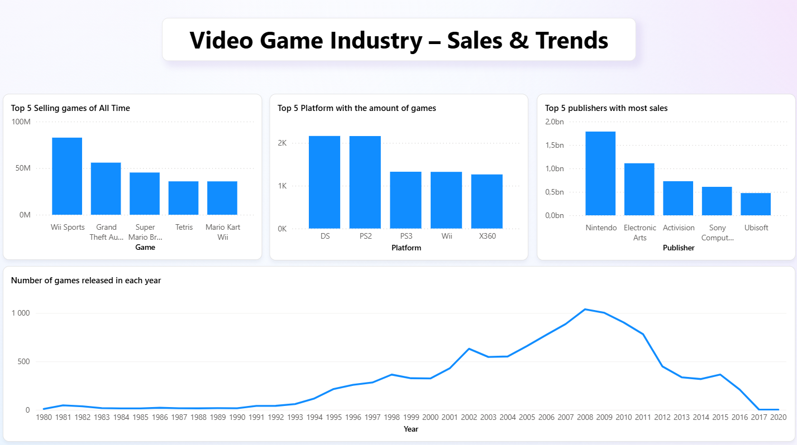
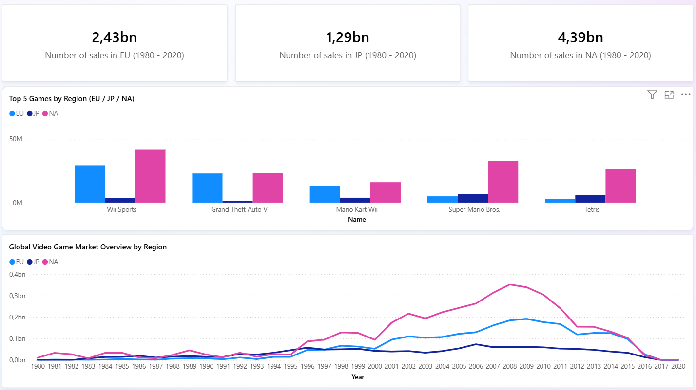
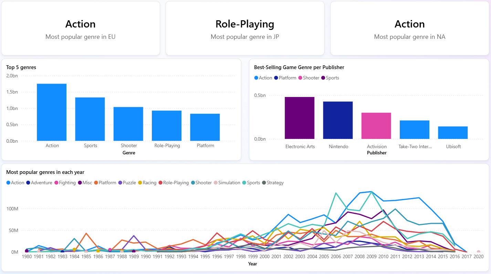

# Video-Game-Industry-Sales-Trends

This dashboard provides a comprehensive overview of the global video game industry based on historical sales data. It analyzes trends in game releases, sales performance across top publishers and platforms, and regional distribution of best-selling titles. It also includes genre-based insights, highlighting shifts in player preferences and dominant genres in major markets (EU, JP, NA). Key metrics include total sales, most popular genres, and regional market comparisons.

## Highlights
- Identified top-selling games and platforms by global and regional metrics
- Analyzed genre popularity evolution over time
- Visualized publisher performance and genre dominance by region
- Created segmented views for better understanding of global vs. regional trends

## Overview

## Breakdown by Region

## Game Genres Analysis

